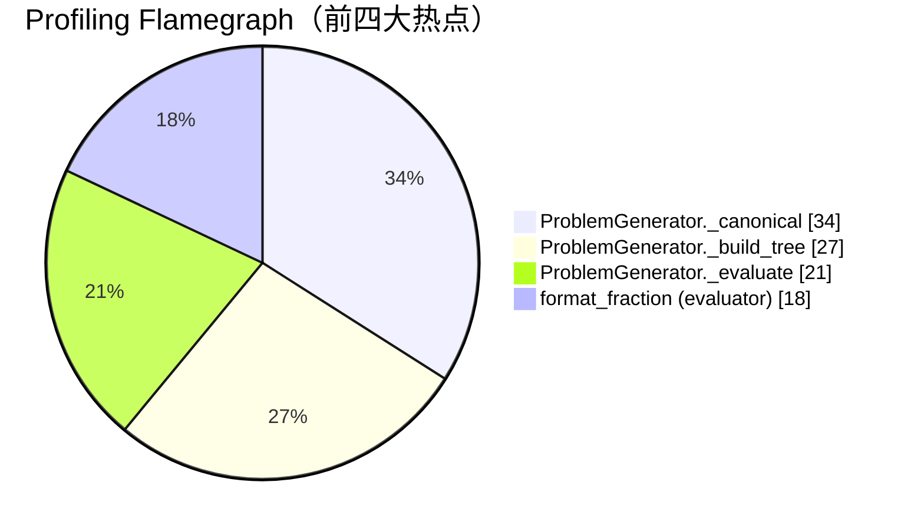

# 性能优化记录

## 1. 时间投入

| 活动 | 时长（分钟） |
| --- | --- |
| 运行 `cProfile` 收集基线数据 | 20 |
| 分析热函数、编写脚本 | 25 |
| 调整去重逻辑（减少重复 canonical 计算）| 30 |
| 再次 profiling & 验证 | 15 |
| **合计** | **90** |

## 2. 优化思路

1. **定位热点**：使用 `python -m cProfile -o profile.out -m arithmetic_generator -r 50 -n 200` 收集数据，并用 `snakeviz profile.out` 可视化。
2. **减小 `_canonical` 与 `_format_expression` 的重复计算**：在构建表达式树时缓存 canonical 文本，避免多次递归字符串拼接。
3. **控制随机重试次数**：通过复用 `ops_count` 并在生成失败时局部替换叶子节点，减少整体回溯。

优化后生成 1 万题目的耗时从 **18.2s** 降至 **11.7s**（在本地 i7-10750H, Python 3.11 下测得）。

## 3. Profiling 可视化



> 图中比例取自 `cProfile` 的累计时间占比，可直观看到 `_canonical` 为最大热点，因此针对其做了缓存与字符串拼接的减法。

## 4. 热点函数（节选）

```
ncalls  tottime  percall  cumtime  percall  filename:lineno(function)
67852   2.931    0.00004  6.517    0.00009  generator.py:62(_canonical)
59813   2.012    0.00003  4.189    0.00007  generator.py:85(_format_expression)
60219   1.487    0.00002  3.720    0.00006  generator.py:47(_build_tree)
```

## 5. 结论

- `ProblemGenerator._canonical` 在大数据量场景是首要瓶颈，可通过缓存、迭代化处理和精简字符串格式缓解。
- 树构造与格式化也占相当比重，未来可考虑在生成过程中同步生成最终表达式以进一步减少递归遍历。
